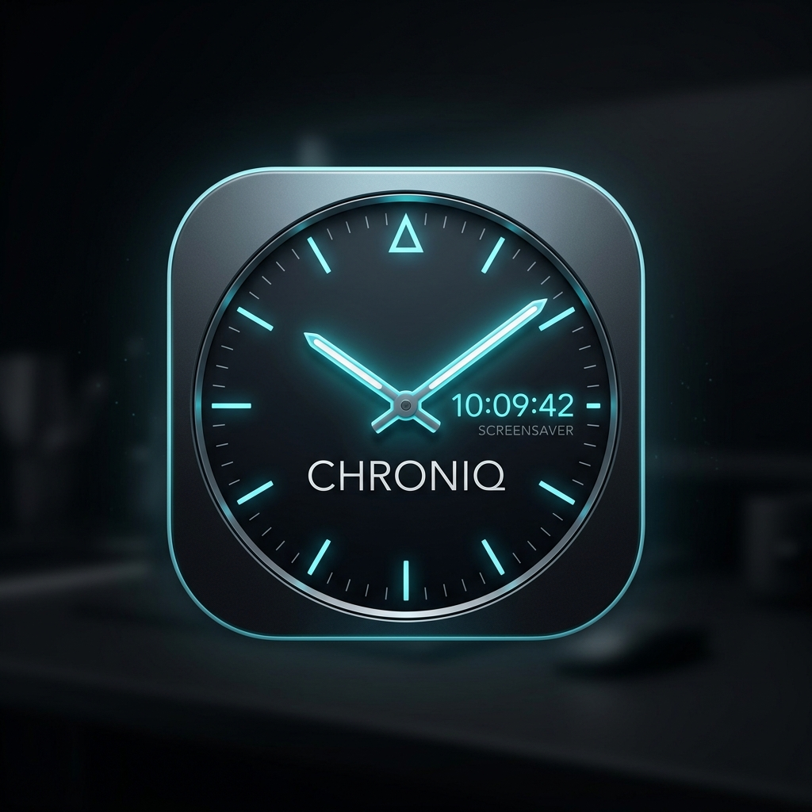

<div align="center">



# ⏳ Chroniq Screensaver
### *The Ultimate Aesthetic Analog & 3D Flip Digital Screensaver for Windows*


<p align="center">
  <b>Screensaver Jam Dual-Mode (Analog & Digital) Modern, Elegan, dan Berperforma Tinggi untuk Windows.</b><br>
  Dirancang dengan arsitektur modular C# native, animasi lipat kartu 3D ala <i>Fliqlo</i>, gerakan jarum mekanik 60 FPS, kustomisasi palet warna penuh, dan proteksi anti-burn-in untuk layar OLED.
</p>

[✨ Fitur Utama](#-fitur-utama) •
[🛠️ Teknologi](#️-teknologi-yang-digunakan) •
[📋 Prasyarat](#-prasyarat-sistem) •
[📁 Struktur Proyek](#-struktur-proyek-modular) •
[🚀 Cara Pemasangan](#-cara-pemasangan--penggunaan) •
[📐 Logika Arsitektur](#-arsitektur--logika-matematika) •
[⚖️ Hak Cipta & Privasi](#️-hak-cipta--kebijakan-privasi)

---

</div>

## 📖 Tentang Chroniq

**Chroniq** adalah aplikasi screensaver desktop Windows modern yang menggabungkan keindahan estetika minimalis (terinspirasi dari jam mekanik mewah Swiss dan jam flip retro modern) dengan komputasi grafis vektor native berkecepatan tinggi.

Aplikasi ini dikompilasi secara langsung menggunakan compiler native Microsoft C# (`csc.exe`) menjadi biner mandiri yang sangat ringan tanpa memerlukan dependensi pihak ketiga yang berat.

### 🌟 Keunggulan Utama
- ⚡ **Startup Instan 0ms (*Zero-Flash*)**: Menghilangkan jeda dekompresi dan kilatan layar abu-abu bawaan Windows saat screensaver aktif.
- 🕰️ **Dual Engine Mode**: Beralih bebas antara **Jam Analog Mekanik** dan **Jam Digital 3D Split-Flap Card**.
- 🧈 **Smooth Sweep 60 FPS**: Pergerakan jarum detik mengalir mulus tanpa patah-patah layaknya jam tangan *automatic movement*.
- 🛡️ **Proteksi Layar OLED (*Sub-Pixel Anti-Burn-In*)**: Pergeseran mikro orbital orbital halus yang melindungi layar OLED/AMOLED dari retensi gambar permanen.
- 📦 **1-Click Standalone Installer GUI**: Pemasangan, konfigurasi, test preview, dan pencopotan instalasi hanya dengan satu klik mudah.

---

## ✨ Fitur Utama

### 1. 🔀 Dual-Mode Tampilan

#### 🕰️ Mode Jam Analog
- **Modern**: Tipografi bersih kontemporer dengan angka Arab `1`–`12` dan jarum tapered ramping.
- **Classic / Vintage**: Angka Romawi (*I* – *XII*), rel menit *railroad track*, dan penempatan lencana tanggal yang proporsional.
- **Bauhaus / Swiss Railway**: Terinspirasi dari jam stasiun Swiss legendaris dengan penanda balok tegas dan jarum detik piringan merah khas.
- **Sport / Diver**: Penanda tebal kontras tinggi dengan jarum panah sporty berkarakter.
- **Minimalist**: Tampilan bersih bebas distraksi tanpa angka (hanya titik/garis penanda melayang).

#### 🔢 Mode Jam Digital (Flip & Minimal)
- **3D Split-Flap Card (ala Fliqlo)**: Animasi kartu atas dan bawah yang terlipat 3D secara mekanis dengan trigonometri kosinus, bayangan kedalaman (*depth shading*), garis lipatan (*crease*), dan engsel samping (*hinges*).
- **Minimalist Digital**: Tipografi angka digital besar modern tanpa bingkai kartu.
- **Format 12-Jam & 24-Jam**: Mendukung format 24-jam (`23:50`) maupun 12-jam dengan tag AM/PM berlatar transparan yang terisolasi aman dari angka jam.
- **Detik Digital**: Kartu detik tambahan opsional yang dapat diaktifkan atau disembunyikan.

---

### 2. ⏱️ Kontrol Jarum & Animasi (Motion Control)
- **Toggle Independen**: Bebas menyalakan atau mematikan Jarum Jam (*Hour*), Jarum Menit (*Minute*), maupun Jarum Detik (*Second*).
- **60 FPS Smooth Sweep**: Jarum detik meluncur mulus tanpa efek patah-patah (*micro-stuttering*).
- **Classic Quartz Step**: Pilihan gerakan melompat 1 kali per detik seperti jam dinding quartz tradisional.

---

### 3. 🎨 Palet Warna Penuh & 8 Preset Siap Pakai
Pengguna dapat mengkustomisasi setiap elemen visual secara independen:
- Latar belakang layar (*Background*)
- Piringan jam / Kartu digital (*Dial / Card Face*)
- Garis batas lingkaran / kartu (*Border*)
- Garis penanda jam & menit (*Markers*)
- Teks angka / Digit digital (*Numerals*)
- Jarum jam, menit, dan jarum detik
- Titik poros tengah / Garis lipatan (*Accent & Divider*)
- Kotak latar & teks lencana tanggal

#### 8 Preset Bawaan:
1. 🌑 **Modern Dark** — Gelap elegan kontemporer.
2. 🔲 **Fliqlo Monochrome** — Nuansa klasik flip clock hitam-putih.
3. 🏛️ **Classic Vintage Roman** — Krim lembut, angka Romawi, dan aksen emas klasik.
4. 🇨🇭 **Swiss Railway (Bauhaus)** — Putih bersih dengan jarum detik merah khas.
5. 🌌 **Midnight Sapphire** — Biru safir malam dengan aksen cyan futuristik.
6. ⚡ **Cyberpunk Neon** — Kontras gelap dengan aksen neon magenta & cyan.
7. 🪨 **Minimal Slate** — Abu-abu slate monokromatik modern.
8. 🌲 **Emerald Luxury** — Hijau zamrud tua dengan detail emas mewah.

---

### 4. 🌐 Format & Bahasa Tanggal
- **Default Sistem**: Mengikuti format dan bahasa Windows secara otomatis.
- **Bahasa Indonesia Ringkas**: Contoh: `RAB 20 AGU`
- **English Short**: Contoh: `WED 20 AUG`
- **Indonesia Lengkap**: Contoh: `Rabu, 20 Agustus`
- **English Full**: Contoh: `Wednesday, 20 August`
- **Format Numerik**: Contoh: `20/08/2026`

---

## 🛠️ Teknologi yang Digunakan

| Modul / Komponen | Teknologi | Deskripsi |
| :--- | :--- | :--- |
| **Core Architecture** | **C# / .NET Framework 4.5+** | Kode terstruktur berbasis OOP bersih, ringan, dan cepat. |
| **Vector Rendering** | **Windows GDI+ (System.Drawing)** | Anti-Aliasing, HighQualityBicubic, dan ClearTypeGridFit. |
| **Animation Loop** | **High-Precision Timer & Stopwatch** | Rendering terkunci pada true 60 FPS tanpa lonjakan beban CPU. |
| **OS Integration** | **Win32 API (User32 / Shell32)** | Menangani argumen native Windows screensaver (`/s`, `/c`, `/p`), multi-monitor, dan DPI scaling. |
| **Installer Engine** | **WinForms 1-Click GUI Installer** | Pengaturan registry otomatis `Control Panel\Desktop` dan penyalinan file ke `%LocalAppData%`. |
| **Web Simulator** | **HTML5 Canvas & Tailwind CSS** | Simulator interaktif online untuk mencoba seluruh preset di browser. |

---

## 📋 Prasyarat Sistem

### Untuk Menjalankan Screensaver:
- **Sistem Operasi**: Windows 10 atau Windows 11 (64-bit & 32-bit).
- **.NET Framework**: Versi 4.5 ke atas (*Telah terpasang secara bawaan di Windows 10 & 11*).
- **Kebutuhan RAM / CPU**: $< 25\text{ MB}$ RAM, $< 0.5\%$ penggunaan CPU.

### Untuk Mengkompilasi Kode Sumber (Opsional bagi Pengembang):
- **C# Compiler**: Microsoft `csc.exe` (*Tersedia bawaan di `C:\Windows\Microsoft.NET\Framework64\v4.0.30319\`*).
- **Python**: Python 3.10+ untuk menjalankan skrip build otomatis `scripts/build_screensaver.py`.

---

## 📁 Struktur Proyek Modular

```
chroniq-screensaver/
│
├── 📂 assets/                                # Aset Grafis & Ikon High-Resolution
│   ├── chroniq_icon.png                     # Logo Resmi Chroniq (1024x1024)
│   └── favicon.ico                          # Multi-size Windows Icon
│
├── 📂 src/
│   └── 📂 native/                            # Native Windows Engine (C#)
│       ├── 📂 Core/
│       │   ├── Program.cs                   # Entry Point & Parsing Argumen Windows (/s, /c, /p)
│       │   └── ColorHelper.cs               # Utilitas Warna, Hex Parsing, & Rounded Path
│       ├── 📂 Models/
│       │   └── ClockConfig.cs               # Manajemen Konfigurasi JSON & 8 Tema Preset
│       ├── 📂 Rendering/
│       │   ├── AnalogClockRenderer.cs       # Vector Engine Jam Analog 60 FPS
│       │   └── DigitalClockRenderer.cs      # 3D Split-Flap Card Engine ala Fliqlo
│       ├── 📂 UI/
│       │   ├── ScreenSaverForm.cs           # Jendela Fullscreen & Multi-Monitor Handler
│       │   └── SettingsForm.cs              # Antarmuka Pengaturan Jam & Live Test Preview
│       ├── 📂 Installer/
│       │   └── SetupForm.cs                 # GUI Installer Mandiri 1-Klik (Chroniq_Setup.exe)
│       └── 📂 Native/
│           └── Win32Interop.cs              # Deklarasi P/Invoke Win32 API
│
├── 📂 website/                               # Website Resmi & Web Simulator
│   ├── index.html                           # Landing Page Resmi & Dokumen Hukum
│   ├── js/
│   │   ├── clock_simulator.js               # Canvas 2D / 3D Flip Engine Web
│   │   └── main.js                          # Kontrol Interaktif UI Web
│   └── dist/                                # Biner Siap Unduh untuk Pengunjung
│
├── 📂 scripts/                               # Skrip Build & Otomasi
│   ├── build_screensaver.py                 # Pipeline Kompilasi Otomatis C# & Packaging
│   ├── install_screensaver.bat              # Skrip Batch Pasang Cepat
│   ├── uninstall_screensaver.bat            # Skrip Batch Copot Bersih
│   └── open_settings.bat                   # Skrip Membuka Jendela Konfigurasi
│
├── 📂 dist/                                  # Output Kompilasi Siap Pakai
│   ├── Chroniq_Setup.exe                    # 1-Click GUI Installer Mandiri
│   ├── Chroniq.scr                          # Screensaver Windows Resmi
│   ├── Chroniq.exe                          # Standalone Executable
│   └── Chroniq_Windows.zip                  # Paket Distribusi Lengkap
│
├── .gitignore                               # Aturan Eksklusi Git
└── README.md                                # Dokumentasi Resmi Proyek
```

---

## 🚀 Cara Pemasangan & Penggunaan

### Metode 1: Menggunakan 1-Click Installer (Paling Mudah) ⭐
1. Unduh atau buka file **`dist/Chroniq_Setup.exe`**.
2. Klik tombol **"💾 Pasang ke Windows"**.
3. Chroniq akan otomatis terdaftar sebagai screensaver aktif di sistem Windows Anda!

### Metode 2: Pemasangan Manual File `.SCR`
1. Buka folder **`dist/`**.
2. Klik kanan pada file **`Chroniq.scr`** -> Pilih **Properties** -> Centang kotak **"Unblock"** (jika ada) -> Klik **OK**.
3. Klik kanan kembali pada **`Chroniq.scr`** -> Pilih **Install**.
4. Jendela *Screen Saver Settings* Windows akan terbuka dengan Chroniq terpilih.

### ⚙️ Mengatur Warna, Mode, dan Ukuran Jam:
1. Jalankan **`Chroniq_Setup.exe`** lalu klik tombol **"⚙️ Pengaturan"**, atau buka via *Screen Saver Settings -> Settings...*.
2. Pilih antara **Jam Analog** atau **Jam Digital**.
3. Pilih tema warna favorit Anda atau pilih warna kustom.
4. Klik tombol **"👁️ Test Preview"** untuk melihat hasil jam secara langsung di layar monitor.
5. Klik **"💾 Simpan & Terapkan"**.

---

## 📐 Arsitektur & Logika Matematika

### 1. Perhitungan Trigonometri Jarum Analog (60 FPS Continuous Sweep)
Posisi jarum jam dihitung berdasarkan koordinat polar sudut trigonometri yang diproyeksikan ke bidang Kartesius $(x, y)$:

$$\theta_{\text{detik}} = \left(\text{detik} + \frac{\text{milidetik}}{1000}\right) \times 6^\circ - 90^\circ$$

$$\theta_{\text{menit}} = \left(\text{menit} + \frac{\theta_{\text{detik}} + 90^\circ}{360}\right) \times 6^\circ - 90^\circ$$

$$\theta_{\text{jam}} = \left((\text{jam} \bmod 12) + \frac{\text{menit}}{60}\right) \times 30^\circ - 90^\circ$$

$$x = x_{\text{center}} + r \cdot \cos(\theta), \quad y = y_{\text{center}} + r \cdot \sin(\theta)$$

### 2. Animasi Lipatan 3D Kartu Flip Digital (Split-Flap Trigonometry)
Rotasi kartu flip digital menggunakan transformasi penskalaan vertikal non-linear 2-fase berbasis fungsi kosinus:

- **Fase 1 (Kartu Atas Menutup ke Bawah, $0 \le p < 0.5$):**
  $$\text{scaleY} = \cos(p \cdot \pi), \quad \text{Shadow Alpha} = p \times 1.2$$
- **Fase 2 (Kartu Bawah Terbuka Jatuh, $0.5 \le p \le 1.0$):**
  $$\text{scaleY} = -\cos(p \cdot \pi), \quad \text{Shadow Alpha} = (1 - p) \times 1.2$$

---

## ⚖️ Hak Cipta & Kebijakan Privasi

### 🛡️ Kebijakan Privasi (Privacy Policy)
- **100% Offline**: Chroniq beroperasi sepenuhnya secara offline di komputer lokal Anda.
- **Zero Data Collection**: Tidak mengumpulkan, mencatat, mentransmisikan, atau menjual data pribadi, ketukan keyboard, atau aktivitas pengguna.
- **Konfigurasi Lokal**: Preferensi hanya disimpan di `%LocalAppData%\Chroniq\settings.json`.
- **Bebas Telemetri**: Tidak mengandung SDK analitik, iklan, spyware, atau telemetri latar belakang.

### 📜 Hak Cipta (Copyright Notice)
Seluruh hak cipta, merek dagang, desain visual jam, tata letak antarmuka, dan kode sumber proyek ini dimiliki secara sah dan eksklusif oleh:

```text
Copyright © 2026 Chroniq. Engineered & Crafted by Sulthan Raghib Fillah.
All Rights Reserved.
```

---

<div align="center">

Dibuat dengan dedikasi tinggi untuk keindahan & estetika desktop Windows.  
Hubungi kreator: [**Sulthan Raghib Fillah di LinkedIn**](https://www.linkedin.com/in/sulthan-raghib-fillah/)

</div>
